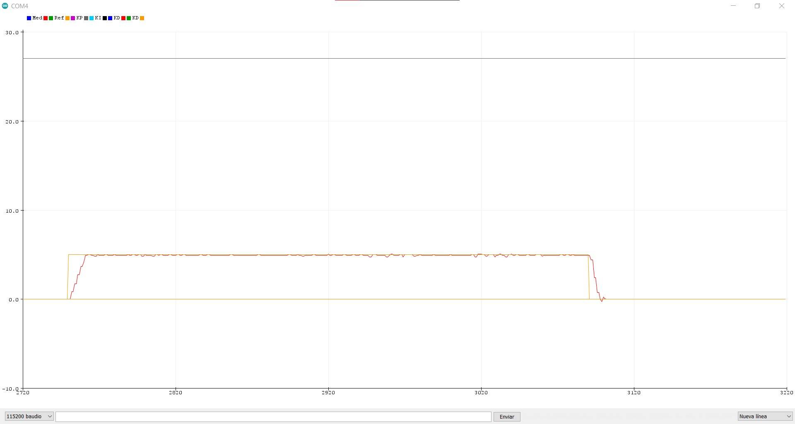
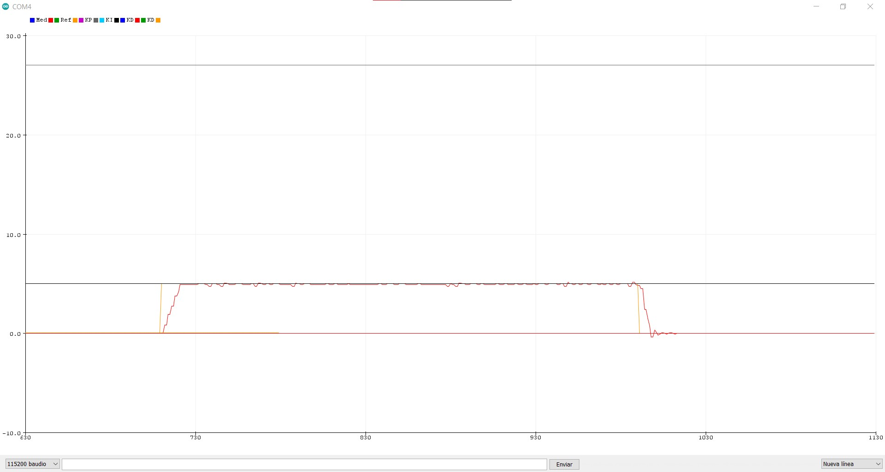
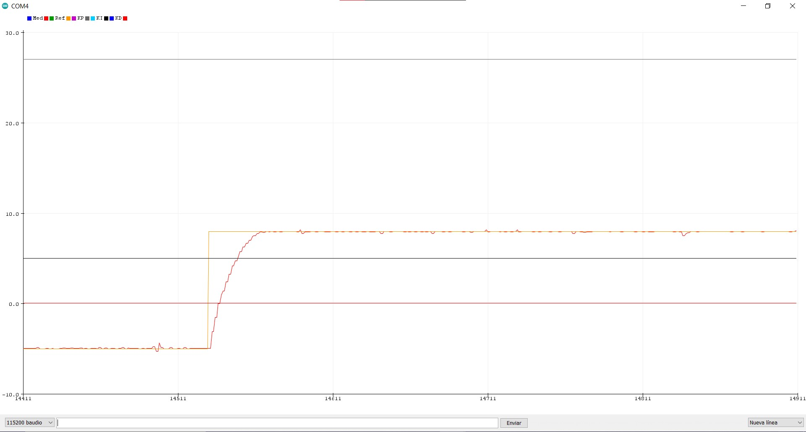
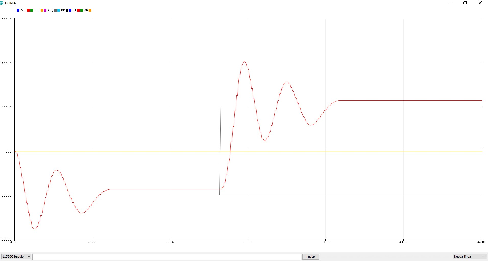
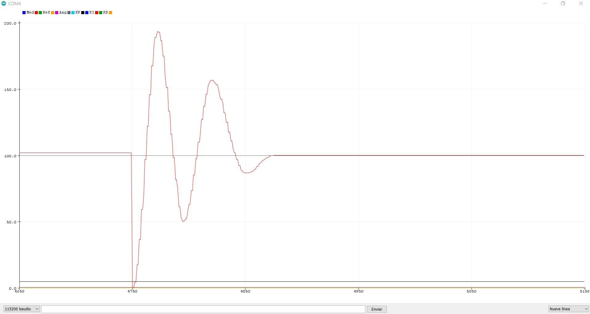
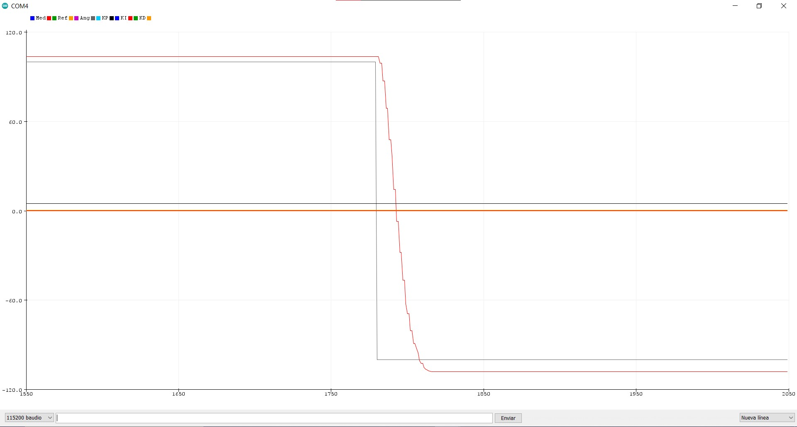
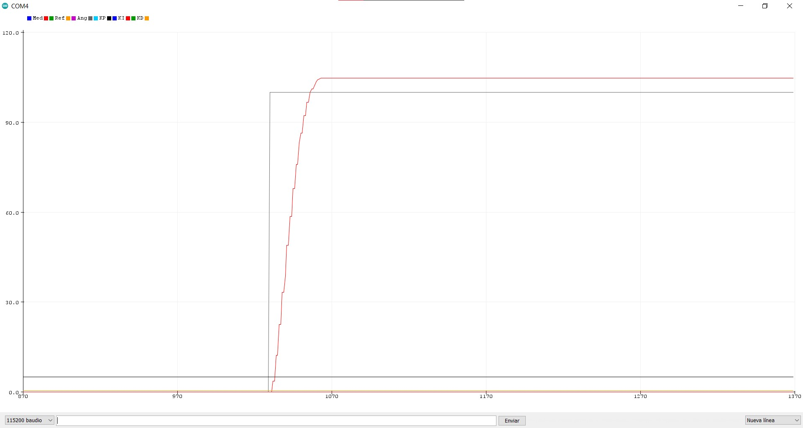

# Memoria proyecto final

Jorge Grau Giannakakis
Luis Belloch Martínez

- [Memoria proyecto final](#memoria-proyecto-final)
  - [Introducción](#introducción)
  - [Implementación](#implementación)
    - [Control de velocidad](#control-de-velocidad)
    - [Control de ángulo](#control-de-ángulo)
  - [Conclusiones](#conclusiones)

## Introducción

En esta práctica final se han implementado correctamente el control de velocidad y el
control de ángulo del motor.

En ambos controladores se han implementado P, PI y PID de forma individuales que se pueden
modificar con el comando KPX, KIX y KDX respectivamente (donde X es el valor que se quiere
asignar). El resto de comandos son:
- M: cambia de modo ángulo a velocidad y viceversa. Al cambiar de modo ajusta los valores
  KP, KI, KD a los óptimos para el motor.
- R: asigna la velocidad de referencia en RPS.
- A: asigna el ángulo objetivo en grados.
- S: detiene la ejecución de las tareas o las activa si están detenidas.
- K: seguido de P, I o D asigna el valor a KP, KI o KD respectivamente.

## Implementación

### Control de velocidad

Tenemos las funciones de cada controlador en ecuaciones de diferencias finitas:

vp = Kp * e[n]

vi = vi[n-1] + Ki*Tm

vd = (Kd/Tm) * (e[n] - e[n-1])

Y los parámetros:
- v_medida_anterior (velocidad del motor de la ejecución [n-1])
- velocidad (velocidad actual del motor)
- errorRps (error relativo de velocidad)
- error_anterios (error de velocidad de la ejecución [n-1])
- vi_anterior (valor del integrador de la iteración anterior)
- Tm (periodo de muestreo)
- pwm_volt (voltaje de entrada al motor)


El algoritmo empieza midiendo la velocidad actual del motor y la compara con la velocidad
de referencia. Después calcula los valores vp, vi y vd y los suma. El resultado es el
voltaje de input al motor. Esto se repite cada Tm.

```
// Medida de velocidad
v_medida = (2*pi*ang_cnt)/pasos_vuelta;
float diferencia_angulos = v_medida - v_media_anterior; // rad
// Periodo de muestreo
float Tm = 0.01;//BLOQUEO_TAREA_LOOPCONTR_MS / 1000;
// Velocidad actual medida en RPS
float velocidad = ((diferencia_angulos)/(Tm*2*pi)); // vuelta/s (rps)

// Guarda la velocidad actual para la siguiente iteración
v_media_anterior = v_medida;
v_medida = velocidad;
errorRps = ref_val - velocidad;

// Calcula las vp, vi, vd
float vp = K_p*errorRps;//Vp[n] = Kp*E[n]
float vi = K_i*Tm*errorRps+vi_anterior; // Vi[n] = Kp*Tm*E[n]+Vi[n-1]
float vd = (K_d/Tm)*(errorRps-error_anterior); // Vd[n] = Kp/Tm*(E[n]-E[n-1])
float v = vp+vi+vd;
// Aplica el voltaje al motor
pwm_volt = v;
excita_motor(pwm_volt);
vi_anterior = vi;
error_anterior = errorRps;
```

Controlador P

`K_p = 27;`



Controlador PI

```
// parte integradora
Ti = 5.4;
K_i = K_p / Ti;
```

`K_i = 5;`



Controlador PID

```
// parte derivativa
Td = 0.0025;
K_d = K_p * Td; 
```

`K_d = 0.675;`



### Control de ángulo

Y los parámetros:
- v_medida_anterior (velocidad del motor de la ejecución [n-1])
- velocidad (velocidad actual del motor)
- error_anterior (error medido en la iteración anterior [n-1])
- errorAng (error relativo de velocidad)
- vi_anterior (valor del integrador de la iteración anterior [n-1])
- Tm (periodo de muestreo)
- pwm_volt (voltaje de entrada al motor)

```
v_medida = (2*pi*ang_cnt)/pasos_vuelta;
float v_angulo = v_medida *((360)/(2*pi));
float ref_ang_machine_top_learning_program = ref_ang /((360)/(2*pi));
float Tm = 0.01;//BLOQUEO_TAREA_LOOPCONTR_MS / 1000;
errorAng = ref_ang_machine_top_learning_program - v_medida;
float vp = K_p*errorAng; //Vp[n] = Kp*E[n]
float vi = K_i*Tm*errorAng+vi_anterior; // Vi[n] = Kp*Tm*E[n]+Vi[n-1]
float vd = (K_d/Tm)*(errorAng-error_anterior); // Vd[n] = Kp/Tm*(E[n]-E[n-1])
float v = vp+vi+vd;
// Excita el motor con pwm_volt
pwm_volt = v;
excita_motor(pwm_volt);

vi_anterior = vi;
error_anterior = errorAng;
```

Controlador P

`K_p = 5;`



Controlador PI

`K_i = 0.10;`



Controlador PID

`K_d = 0.5;`




## Conclusiones

Con esta práctica hemos aprendido a implementar un controlador PID utilizando los
conocimientos teóricos de controladores.

El planteamiento de la asignatura como una larga y complicada no es erróneo. La guía del
alumno facilita el seguimiento de la misma en gran medida, además de las primeras
prácticas donde realmente se puede ver la aplicación de los conceptos aprendidos. Las
últimas prácticas sí se han hecho algo más pesadas. En general la sensación final de la
asignatura es que hay pocas cosas que realmente vaya a recordar más adelante, pero los
conceptos quedan más claros. Hay algunas partes más específicas, de la teoría sobre todo,
que ni siquiera hemos llegado a aplicar en las prácticas.

Además cabe añadir que la práctica final ha sido especialmente complicada de realizar, aún
teniendo como referencia las prácticas anteriores. Por esto recomendaría empezar con estas
prácticas en un punto algo más temprano en el curso. Ya que las primeras son más fáciles
de seguir pueden terminarse antes y pasar a las más complicadas con más tiempo.
